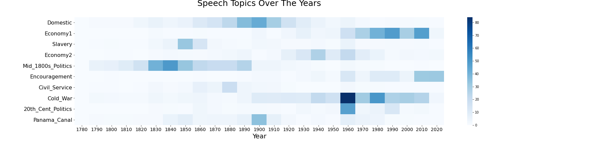
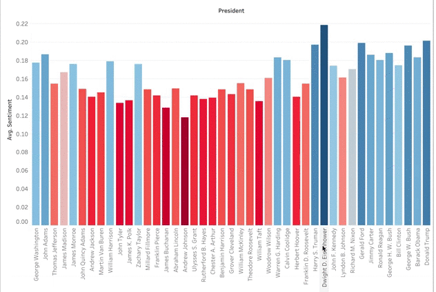
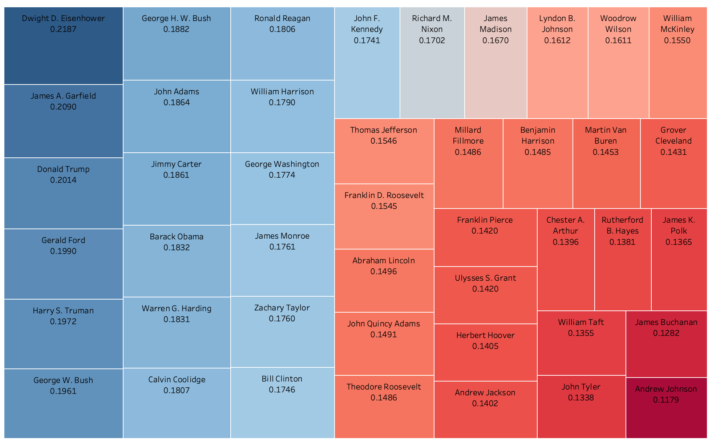
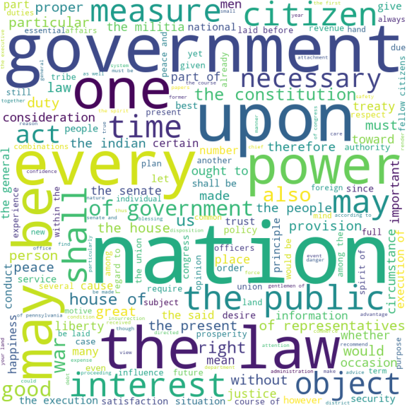

#### By: Nicole Semerano

Natural Language Processing intrigued me from the beginning.  I first heard about it at a presentation of an author predictor based on word patterns.  It later was explained to me with song lyrics across the decades.  So I sought to also use it in an historic way.  And where could I get a lot of data?  Presidents: they love to talk!  Or at least most did.  So I created a NLP project on Presidential speeches in American history. It includes all 44 presidents from George Washington's first inauguration in 1789 to speeches on Coronavirus at the end  April of 2020. Yes, I said 44 presidents as Grover Cleveland had two separate terms.  Fair warning as you read along:  I was an American Studies major and taught history for 12 years.  So don’t mind me as I throw in some presidential knowledge along with my knowledge on Data Science.  Enjoy!

## Speech Organization

I scraped the majority of my speeches with Selenium from UVA's Miller Center.   Their collection of speeches and other primary sources is considered top-notch, even being referenced by Harvard’s database.  The page required scrolling so I needed more than your basic Beautiful Soup in scraping. 

As I started cleaning up and analyzing my data, I realized some presidents should have had more speeches than were present in this collection.  I could fix this for Truman and Eisenhower by adding in their missing State of the Union Speeches from the NLTK’s corpus.  Every other president in this corpus had their SOU speeches already in the Miller Center collection.  In total my analysis included 1018 speeches with approximately 23.8 million words.  The math side of me did have to look at a few numbers and stats.  The shortest speech came from George Washington’s Second Inaugural Address with 787 words.  On the other hand, the longest speech goes to Harry Truman’s State of the Union address in 1946 at just shy of 170 thousand .  He had to discuss such historic topics as the post-war economy, protection for veterans, the creation of the United Nations, communism concerns...and that doesn’t even cover the first half!    
The data, each being a full speech, has understandable asymmetry.  I could have scraped other speeches from other sources, but it would have made it extremely skewed to modern times.  Technology such as the radio and television led to more speeches versus letters written.  Examples of this already in the data set include televised Addresses to the Nation and FDR’s Fireside Chat’s.  

**********Put bar graph here***********

I color coded my bar graph to represent presidents who served more than one term versus 4 or less years.  Lyndon Johnson, with the most, had historic events such as the Civil Rights Acts and the Vietnam War to address.  On the flip side, the two presidents with only one speech in the collection died months into their term. William Henry Harrison died specifically BECAUSE he gave his 2-hour inaugural speech in a snowstorm outside without a coat on.

## Topic Modeling
I first split up each speech to check the frequency of all the words.  Here I was able to make my own list of stop words in preparation of count vectorizing.  Some words I was not surprised to find, like ‘united’, ‘states’ and ‘america’.’ One that caught me off guard but made sense was ‘thank’ and ‘you’.  Think of how many speeches start off with that phrase or are thanking people later on for their accomplishments.  Two other words of note are ‘applause’ and ‘transcript’.  This just shows how the speeches are documented for history along with how presidents and their speech writers make notes within the speech. 

I processed the data with a Count Vectorization with a df-maximum of 40% . This allowed many of the random topics to be filtered out of my topic modeling.  On the other hand I combined the NLTK’s stopwords with my list of over a dozen words to filter out the words that show up too much.  I settled on the nonnegative matrix factorization(NMF) for my modeling. I experimented with various topic modelers and vectorizers.  Using my knowledge of history, I did not like anything about what LDA put out.  Within NMF, the TDIF Vectorizer created mismatched topics. It had two different categories based on the Vietnam War yet missed major topics that I found in my final result that I will discuss below.  I also experimented with how many topics to focus on.  This part of NLP really is like Goldielocks and the 3 Bears.  I tried 5, that was too little.  I tried 15 and that was too much.  My initial run of 10 ended up being the perfect amount.   


When I ran it that first time I got to appreciate NLP’s full power.  The first two topics were words that related to domestic and economic affairs.  Ok, makes sense.  Then I read the 3rd topic.  I realized all the words had to do with slavery and the antebellum compromises.  I was ecstatic.  NMF was supposed to be better for short text documents.  However its benefits shined through.   NMF learns topics by directly decomposing the term-document matrix and it reduces the dimensions to find the main topics of the speeches.  And here it was taking all the speeches and realizing that slavery was a topic that not only enveloped our country for decades leading to a Civil War but also continued to be something that Presidents discussed decades after its abolition.

I set out to find a correlation with all of the 10 topics.  Topic modeling showed me some topics I wouldn’t expect, such as the Civil Service establishment.  I used to teach this in about 20 minutes yet this shows teachers should give this more emphasis. Also, there was a topic I best named ‘Encouragement’.  You have Presidents that have campaign slogans of positivity that make it into their presidency, but that has been going on for years.  This topic shows up in the 1950s with the advent of television and proves that television has shaped the presidency probably more than any invention.  There  are a few topics that no matter my tinkering, I was surprised never showed up as a major topic. There were no words or topics that I could find that related specifically to the World Wars or the creation of new amendments.  

I’m a visual learner and creating a heatmap taught me even more.  Summing up the words of each topic you can observe them across time.
```
doc_topic_nmf = pd.DataFrame(doc_topic.round(3),
                             index = df.Year.astype(int), 
                             columns = ["Domestic","Economy1", "Slavery","Economy2","Mid_1800s_Politics",  
                     "Encouragement","Civil_Service", "Cold_War","20th_Cent_Politics", "Panama_Canal"
                     ])
dtn = doc_topic_nmf.groupby(doc_topic_nmf.index).sum()

dtn.reset_index(level = 0, inplace = True)
graph_topics = dtn.groupby(dtn.Year // 10 * 10).sum()
graph_topics.drop(['Year'], axis=1, inplace = True) 
plt.figure(figsize = (25, 6))
sns.heatmap(graph_topics.T, annot=False, cbar=True, cmap="Blues")
plt.xlabel('Year', fontsize = 20)
plt.xticks(fontsize = 14)
plt.yticks(fontsize = 16)
plt.title('Speech Topics Over The Years\n', fontsize=25)
```


The darkest box in the heatmap below belongs to the Cold War in the 1960s.  This time period whether good(Space Race) or bad (Cuban Missile Crisis) encompassed the United States in many ways.  The darker stretch in the 1800s Politics demonstrates how this is a time period that should not be shortchanged in its teachings.  The politics around the National Bank were a debate for years.  Furthermore the Mexican American War and Manifest Destiny thoughts formulated the shape and land of our country. 

<p align="center">
  
</p>


## Sentiment Analysis

The second major analysis I did was sentiment analysis.  I went into this cautiously as I knew my data is pre-written speeches.  Half the time they are not written by the president himself but by a team of speechwriters. If you want real true feelings go listen to the LBJ's tapes on YouTube. Or maybe you follow Donald Trump on Twitter.  However, in the end I saw sentiment results that matched many of our presidents.  I utilized both NLTK’s VADER Sentiment Intensity Analyzer and its basic Sentiment Analyzer.  These tools allow you to look at both negative and positive ratings, but I decided to focus on their positivity scores.  In either area, the scores have low percentages and that is ok.  These speeches are content based, and that is a good thing.  Even when a president is conveying something negative, say communism in the 1950s, sentiment analysis is not going to pick up on that.  On the flip side, take a look at the beautiful language of famous Gettysburg Address:

*"Fourscore and seven years ago our fathers brought forth, on this continent, a new nation, conceived in liberty, and dedicated to the proposition that all men are created equal.”*

Maybe right now you’re all warm and fuzzy right now reading that iconic line.  Yes, words like ‘new’ and ‘equal’ will get points.  But overall, this involves a lot of neutral language that when strung together has a much different meaning.  But that is what is so amazing with Sentiment Analysis.  It picks up on the little nuances.  Moreover VADER was specifically designed to deal with domain-specific language.  

To create a table to show in a Tableau graph, I instituted the following:

```
def sentiment_analysis_graph(president):
    filter1 = df.President.str.contains(president)
    func_df = df.loc[filter1]
    text = ''.join(str(func_df.Split[:]))
    score = SentimentIntensityAnalyzer().polarity_scores(text)
    return score['pos']
```

So as you can see below Dwight Eisenhower had the highest positivity sentiment.  This can be explained by the prosperity, culture and good economy of the 1950's. The higher numbers across the board in the last half century correlates with the topic modeling topic of ‘Encouragement’.  I was surprised that there was not lower positivity during hard times such as the Great Depression, the Vietnam War, or other wars.  In my negative sentiment analysis there was not a peak then either. I guess this gets back to those encouragement vocabulary where US presidents used rally cries and language of reassurance during the hard times. 



There is a better way to visualize this information.  Since the values are so similar, the bar graph doesn’t really work for comparing multiple presidents.  It is easy to see Eisenhower as the most positive or Andrew Johnson as the least, but there are too many presidents that differ by tenths of a percent. A Tree Map, however, shows the clear transition from most positive to least.   To create the Tree Map I did not code any Python.  I created a csv file from the President’s sentiment scores.  I then uploaded this along with my main Speeches dataframe to Tableau.  I enjoy how this visualization tool helps organize data, is interactive, and lets me color code features. 

I want to note two presidents who rounded out the top 10 most positive.  John Adams is what I nicknamed the ‘Rebound’ president in my US History classroom. He came after George Washington yet could never live up to him.  That combined with the XYZ Affair led him to be the only founding father to serve only one term.  This tree map recognizes him for the great orator he was.  Much later in our history you have Jimmy Carter, another man that struggled as president.  I once had a very conservative college professor say Carter was the nicest guy to be president. That kindness comes across in his speeches.

<div style="text-align:center"></div>


Yet down in the lower right corner are the least positive presidents.  Using content knowledge, this correlates with history.  Andrew Johnson was the first president impeached.  He did not get along with Congress’ Radical Republicans.  They passed the Tenure of Office Act which required senatorial approval of removal of any civil officer and he soon after violated it.  These contentions and disagreements over Reconstruction plans produced the lower sentiment score.  James Buchanan and John Tyler are both considered some of the worst Presidents. You think staff retention under Donald Trump is bad...John Tyler's whole cabinet quit a few months into his presidency! And William Taft did not want to be president. Taft never wanted to be in that sole power position.  Yet his wife and Teddy Roosevelt had political ambitions for him that led him to comply.  This data shows his unhappiness and his yearning to his eventual post as Chief Justice of the Supreme Court.  

## Word Clouds


<p align="center">
  
</p>

One last NLP analysis I did was compare top vocabulary used by different presidents.  I used Word Clouds which highlight words that are used more frequently.  I was not going to do this with all 44 Presidents, but I picked obvious people like Washington and Lincoln along with some personal favorites.  Many of these word clouds had vocabulary that mentioned the government and features of it like the Senate or the Constitution. I also looked at 2 presidents I personally thought did not have great oratory skills.  Even here the data showed personal opinions are not always true as one of them had a word cloud that was comparable to my picks for ‘greats’.  The other, all I can express is…

<p align="center">
  
</p>

I hope you enjoyed reading about my project as much as I did creating it.  I tried to stay balanced throughout the project.  I did not include analysis with comparing or clustering speeches based on political party for two main reasons.  One, I did not want to add to the divisiveness culture.  Secondly, the Republican and Democratic Parties have not always been around.  And initial parties like the Federalists only lasted the first 50 years of the country.  I did not want to group the older parties into an ‘other’ category in calculations as the parties had polarizing viewpoints. I taught history for many years in an area where my political beliefs did not match the families I taught.  My biggest thing with students was to try to show them to look at both sides.  If you’re interested in checking out the code and materials that went with this project, check out my [Github](https://github.com/nicolesemerano/Metis-Project-4-Presidential-Speeches-NLP)!  So I leave you with thoughts from George Washington in his Farewell Address.  His sentiment on his presidency matches my sentiment to this project.

*”My feelings do not permit me to suspend the deep acknowledgment ... for the opportunities I have thence enjoyed of manifesting my inviolable attachment, by services faithful and persevering, though in usefulness unequal to my zeal.”*


