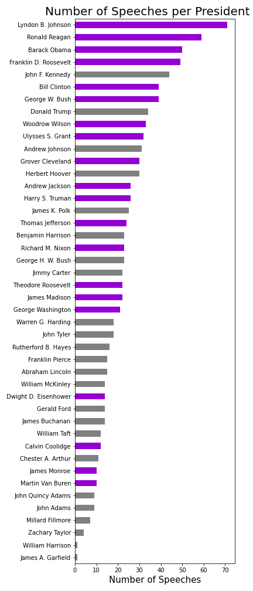

#### By: Nicole Semerano

Natural Language Processing intrigued me from the beginning.  I first heard about it at a presentation of an author predictor based on word patterns.  It later was explained to me with song lyrics across the decades.  So I sought to also use it in an historic way.  And where could I get a lot of data?  Presidents: they love to talk!  Or at least most did.  So I created a NLP project on Presidential speeches in American history. It includes all 44 presidents from George Washington's first inauguration in 1789 to speeches on Coronavirus at the end  April of 2020. Yes, I said 44 presidents as Grover Cleveland had two separate terms.  Fair warning as you read along:  I was an American Studies major and taught history for 12 years.  So don’t mind me as I throw in some presidential knowledge along with my knowledge on Data Science.  Enjoy!

I scraped the majority of my speeches with Selenium from UVA's Miller Center.   Their collection of speeches and other primary sources is considered top-notch, even being referenced by Harvard’s database.  The page required scrolling so I needed more than your basic Beautiful Soup in scraping. 

   

      
    
As I started cleaning up and analyzing my data, I realized some presidents should have had more speeches than were present in this collection.  I could fix this for Truman and Eisenhower by adding in their missing State of the Union Speeches from the NLTK’s corpus.  Every other president in this corpus had their SOU speeches already in the Miller Center collection.  In total my analysis included 1018 speeches with approximately 23.8 million words.  The math side of me did have to look at a few numbers and stats.  The shortest speech came from George Washington’s Second Inaugural Address with 787 words.  On the other hand, the longest speech goes to Harry Truman’s State of the Union address in 1946 at just shy of 170 thousand.  He had to discuss such historic topics as the post-war economy, protection for veterans, the creation of the United Nations, communism concerns...and that doesn’t even cover the first half!  
  
The data, each being a full speech, has understandable asymmetry.  I could have scraped other speeches from other sources, but it would have made it extremely skewed to modern times.  Technology such as the radio and television led to more speeches versus letters written.  Examples of this already in the data set include televised Addresses to the Nation and FDR’s Fireside Chat’s. I color coded my bar graph to represent presidents who served more than one term versus 4 or less years.  Lyndon Johnson, with the most, had historic events such as the Civil Rights Acts and the Vietnam War to address.  On the flip side, the two presidents with only one speech in the collection died months into their term. William Henry Harrison died specifically BECAUSE he gave his 2-hour inaugural speech in a snowstorm outside without a coat on. 

    
    

## Topic Modeling
I first split up each speech to check the frequency of all the words.  Here I was able to make my own list of stop words in preparation of count vectorizing.  Some words I was not surprised to find, like ‘united’, ‘states’ and ‘america’.’ One that caught me off guard but made sense was ‘thank’ and ‘you’.  Think of how many speeches start off with that phrase or are thanking people later on for their accomplishments.  Two other words of note are ‘applause’ and ‘transcript’.  This just shows how the speeches are documented for history along with how presidents and their speech writers make notes within the speech. 
