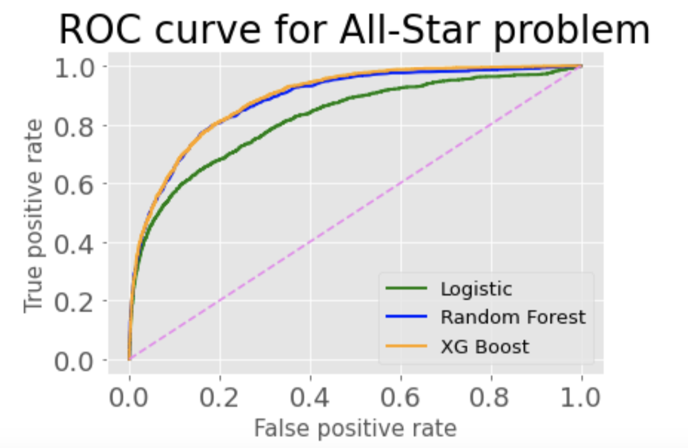
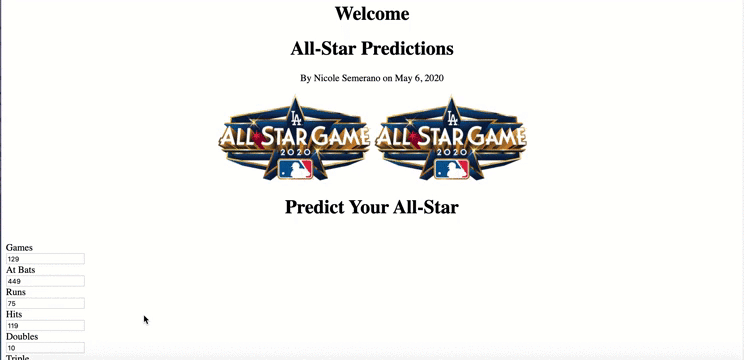

#### By: Nicole Semerano

I was born into a baseball family.  I was raised a Yankees fan, but I have cousins who are Mets and Phillies fans.  So it was only natural that as I explored the Data Science world I complete a project based on baseball.  In this day and age there are so many statistics to choose from:  Player WAR rates, injury probability, where to start?  I decided to go a more classical route.  I will walk you through how I built a classification metric to determine whether a Major League Baseball player would classify as an All-Star.  I know as a fan the process can have its favorites.  Starting players are chosen by fans as a way to get people involved.  However, in some years the starting line-up is made of predominately New York, Boston, and California players.  Then the prior year's World Series manager chooses the auxilary players over a couple of rounds as players with injuries are replaced.  My goal in this classification system was to eliminate or less the bias in this process.   

# Batting Clean-up

  

Like any good project, I started out with cleaning my data.  I downloaded the Lahman's Baseball Database.  I started with the batting statistics to focus on the largest set of players.  Then I eliminated all rows for players prior to 1933 when the All-Star Game started.  I also made sure all my players played at least 35 games and had at least that many at bats (a way to eliminate pitchers).  In the All-Star table of the database I eliminated 1945 as there was no game that year to preserve resources for WWII. Furthermore, I made sure players were only listed once for years 1959-1961 as I learned those years there were two games each year.  I also added a columns of 1s as All-Stars so when I merged this table with the batting statistics I had my target classification values of 0s and 1s.  In both tables and after the merge I also changed many NaN value to zero.  I ended up with 32943 non All-Stars and 4056 All-Stars.  This matched any historical research I had done.

# Spring Training

    

I started off by using 17 features as my X value.  These features ranged from ones you would assume, like hits, RBIs, and runs, to ones you wouldn't, like how many times a player was hit by a pitch.  Fast forward in my experimenting, I tried a model with just the features with the highest importance and it did drastically worse.  In my short time in the data science world I have learned the big rule that the more data or features you have it more likely will make things more accurate.  And this project proves that stance correct.  As said before, the target was whether a player was an All-Star(1) or not(0).  I then made a train/test split with a test size of 30%.  This is maybe a little large compared to what recent theory suggests, but I was following the sample projects shown to me.  

I also dealt with the obvious class imbalance.  There are many methods to accomidating this, but I chose to do it before the actual training of the model.  I wanted to start fresh.  I multiplied the minority class by 5 to oversample it.  I experimented with higher numbers but this caused the model to predict more 0s than it should.  

# When you come to a fork in the road, take it.

Yogi Berra was a wise man in his own way.  And one of his famous quotes came into play during my project.  I experimented with many models with my data.  At the time I knew of five models (ok, really six but was told to rarely use SVM) so I tested them all out. KNN and Logistic Regression models had a decent accuracy but a low AUC score.  Plus I knew it would probably be too simple with my features. Gaussian Naiive Bayes and Decision Trees both had low accuracy scores.  Goodbye.  But Random Forrest showed promise.  It was the only accuracy score in the 90s with a .9092 accuracy and I liked the way the ROC-AUC curve looked.  I was excited that I thought I found my model.

The next day we learned in class about the XG Boost model.  This model created a recursive function to correct small errors over each round of analyzing the data.  And since my model had tens of thousands of lines, not millions, the fact that a Boost model could be time consuming didn't really apply here.  I played around with the parameters of the model, mostly the learning rate.  Long story short, my XG Boost model produced a .9128 accuracy score and a slightly better AUC area than the Random Forest.  It was settled, XG Boost was my model.  

  

I then spent the next few days working on this project using the XG Boost model.  I was making visualizations, testing examples in Jupyter notebook, and much more that I will explain in a minute.  But then I went to create a Flask App for managers and/or fans to input their data into.  I hit a road block.  I kept getting an error "ValueError: feature_names mismatch".  I tried it all to fix this error.  I then learned this is a small problem with XG Boost.  As it goes through its many rounds of updating, sometimes a column gets dropped.  The model is ok with this until you try to classify a new piece of data.  So here I was in my Flask app trying to test out sample numbers of a possible All-Star, and the model couldn't do it.  So I came to the conclusion I had to say goodbye to the XG Boost model and go with Random Forest instead. I sacrificed the 1% accuracy for something reliable.  Talk about a baseball scenario.  It's like taking a pitcher out who is on fire to replace him with a reliever who may not throw as hard but you know will get the next batter out and win you the game. 

# 9th inning

I hope you are doing ok with my baseball analogies.  Thankfully I did not have to do much adjusting going back to Random Forrest as I had already scored its ability.  And testing its predictions out was similar to XG Boost so I didn't have to reinvnent the wheel.  One thing I had to check was what threshold I wanted to use.  This is another way to find the right balance and make the best model with data that had been unbalanced.  I ended up finding the threshold of .25.  This created the following confusion matrix:

  

I settled on this with my model for a couple of reasons.  One, it realistically portrays the rate at which people are selected to the All-Star team.  The True Negatives are the many people who do not make the team while the True Positives are the select few that do.  Secondly, I kept my False Negatives low.  I would hate for my model to keep someone off the All-Star team that truely deserved it.  Yet, this threshold kept my False Positives from being too high as some other thresholds did.  I would rather have a player be on the team that really didn't deserve it.  From a fan perspective, my undeserving player makes the team...I'm happy and none the wiser.  But my deserving player is kept off...I'm infuriated and devistated.

# Scorecard

   
In both the XG Boost and Random Forrest, I wanted to test it with data I was familiar with.  I chose to look at the 1999 Yankees.  This included many players that just the year before had been a part of the winningest team in baseball history, acheiving a record of 125-50.  And my hindsight also knows the '99 Yankees ended up going to win it all again, so they had some talent on that team.  I looked and only two hitters, Derek Jeter and Bernie Williams, had been named an All-Star.  However three other players had good batting averages in the column I created.  Yet when I ran them through the model(the same happened in both models actually), only one, Chuck Knobloch, was deemed to be an All-Star.  The two others, Paul O'Neill and Ricky Ledee, were not.  When I looked at the individual statistics, Knobloch had a lot more runs and less strikeouts than the other two players.  These key features should have put him in the All-Star game.  And it also showed me how important an app like this could be.  Here is my beloved Yankees where at a quick glance of their batting average I could make an assumption on who should be an All-Star.  But a true All-Star needs to be well-rounded and this model can look at all 17 features.  

# Let's Go to the Videotape

Yes, I know, my only non-baseball heading.  If you are from the New York area this is something a local sportscaster would say, so it does relate.  As I mentioned, I created an app to go with this project.  My mindset was it could be used by a fan, like myself, or the All-Star manager.  I would never want this app to be the sole way an All-Star is selected.  I am in the camp that there should still be live umpires and not a camera system at homeplate. It is a game, after all.  On the same note, a manager comes with years of experience that should not be ignored.  My goal was for an app like this to be used in those last few scenarios.  Currently each team gets 34 players.  A manager could use this to determine players 31-34.  Or maybe just even when they have to pick player #35 and #36 when it is declared the players that get injured and cannot play. My desire of this whole project was to take some of the bias out of the selection and I think this does just that.  

At the time of me writing this blog, I will readily admit the style of my app is soooooo basic.  It looks like something a 3rd grader would make.  I have since made more complex CSS designs as you can see in other posts, but I was just proud that it worked. I used the Random Forest model soley in this stage as it could predict statistics that did not come from my pandas table.  Below I have a video of my app in action. I took the statistics of Hank Aaron in 1972, where his numbers were not like in other seasons. Before all you Braves fans think I'm hating on Hank Aaron, I consider him to be the true home run record holder and have great admiration for his career.  I use this example as proof of some of the bias in this selection process.

Here he "only" had 34 home runs that season, his batting average was .265, and his RBI and run totals were the lowest since his 1st season.  Yet he had been named an All-Star, probably more out of his notariety and past accomplishments.  This model and app shows he should not have been an All-Star that year. 

Thank you for reading about my process in classifying All-Stars.  There is still work that needs to be done.  I would like to update the app to be easier to input a players statistics.  Moreover, could I roll out the classification in stages?  For example, just inputting a low number of hits would immediately classify the player with a no before inputting the other 16 features.  I would also like to complete a similar model with statistics of pitchers.  For now, I'm happy with the model I created and the many things I learned along the way.  If you’re interested in checking out the code and materials that went with this project, check out my [Github](https://github.com/nicolesemerano/Metis-Project-3-All-Star-Classification)!
